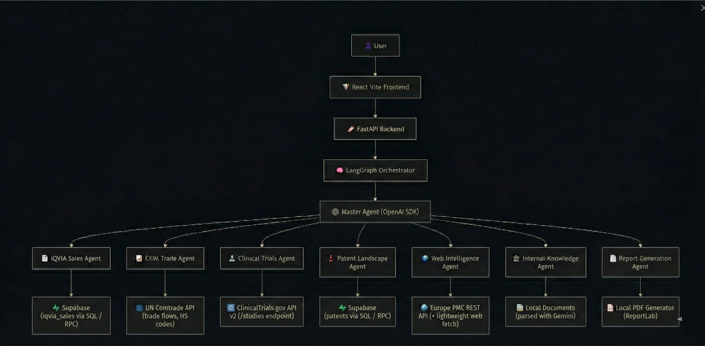
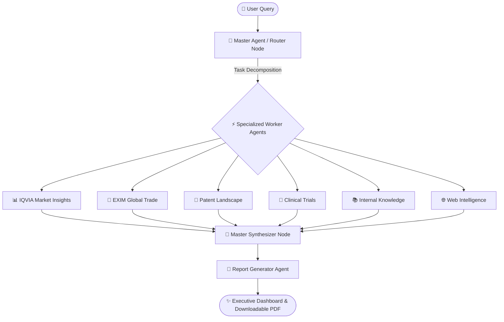

<p align="center">
  
</p>

# 🚀 Sanjaya AI — Agentic AI Platform for Pharmaceutical Innovation Discovery  
**Automated Multi-Agent System for Drug Repurposing, Market Intelligence, Patent Landscaping & Clinical Trials**

[](https://fastapi.tiangolo.com/)
[](https://reactjs.org/)
[](https://vitejs.dev/)
[](https://tailwindcss.com/)
[](https://langchain-ai.github.io/langgraph/)
[](https://www.python.org/)

---

## 📌 Overview  

**Sanjaya AI** automates pharmaceutical molecule evaluation and drug repurposing research. Traditional manual evaluation requires 2–3 months of cross-functional research across regulatory databases, clinical trial registries, scientific papers, trade statistics, and patent registers. Sanjaya AI condenses this into real-time, automated multi-agent workflows.

---

## 🧩 System Architecture

<p align="center">
  
</p>



---

## 🧠 Autonomous Agents

| Agent | Core Function | Data Sources / Tools |
| :--- | :--- | :--- |
| **🧭 Master Agent** | Query decomposition, routing & synthesis | LangGraph, Gemini 2.5 Flash, FastAPI |
| **📊 IQVIA Insights** | Sales volume, revenue trends, CAGR & competitors | Supabase SQL, Commercial datasets |
| **🚢 EXIM Trends** | Global trade flow, sourcing dependencies & trade balance | UN Comtrade API, Trade calculators |
| **📜 Patent Landscape** | Active patent scanning, assignees & expiry timelines (FTO) | Patent SQL tools, Supabase database |
| **🧬 Clinical Trials** | Active trials, phase distributions & lead sponsors | ClinicalTrials.gov API v2 |
| **🌐 Web Intelligence** | Scientific papers, medical guidelines & news | EuropePMC Search API, Web scrapers |
| **📚 Internal Knowledge** | Enterprise document analysis & corporate takeaways | Document parser, Gemini Multimodal |
| **📑 Report Generator** | Executive briefing PDF compilation with charts & tables | ReportLab PDF engine |

---

## 🛠️ Tech Stack

- **Frontend**: React 18, TypeScript, Vite, Tailwind CSS, shadcn/ui, Lucide Icons
- **Backend**: FastAPI, LangGraph, Python 3.11+, ReportLab
- **AI & Models**: Google Gemini via OpenAI-compatible endpoints
- **Database & Storage**: Supabase (PostgreSQL)

---

## 🚀 Quick Start

### 1. Clone the Repository
```bash
git clone https://github.com/jinay-mehta/Sanjaya-AI.git
cd Sanjaya-AI
```

### 2. Backend Setup
```bash
cd backend

# Setup virtual environment
python -m venv .venv

# Windows (PowerShell):
.venv\Scripts\Activate.ps1

# macOS / Linux:
source .venv/bin/activate

# Install dependencies
pip install -r requirements.txt
```

### 3. Environment Configuration
Create `backend/.env` from `.env.example`:
```env
GOOGLE_API_KEY=your_gemini_api_key_here
SUPABASE_URL=your_supabase_url_here
SUPABASE_KEY=your_supabase_key_here
```

### 4. Upload Datasets to Supabase

**Via Web UI:**
1. Go to Supabase Dashboard → **Storage**
2. Create bucket: `datasets`
3. Upload `patents.csv` and `iqvia.csv`

**Via CLI:**
```bash
supabase storage cp ./data/patents.csv datasets/patents.csv
supabase storage cp ./data/iqvia.csv datasets/iqvia.csv
```

### 5. Start Backend Server
```bash
cd backend
uvicorn main:app --reload --port 8000
```
Backend API will run at `http://127.0.0.1:8000`.

### 6. Start Frontend
In a separate terminal:
```bash
cd frontend
npm install
npm run dev
```
Frontend will be accessible at `http://localhost:8080`.

---

## 📄 License

This project is open source and available under the [MIT License](LICENSE).
